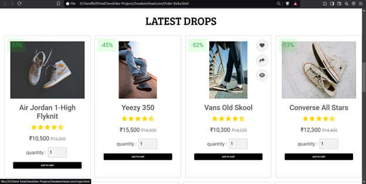

# 👟 SneakerHead.com 👟

<p align="center">
  
</p>

## 🔥 Your Ultimate Destination for Premium Sneaker Services

SneakerHead.com is a comprehensive platform for sneaker enthusiasts, offering professional cleaning, curated shopping, and custom design services - all in one place.

<p align="center">
  
  
  
  
</p>

## ✨ Features

### 🧼 Klean-Kicks
Professional sneaker cleaning and care services to keep your favorite kicks looking fresh.

### 🛒 Order-Kicks
Curated marketplace featuring authentic sneakers from around the world with expert recommendations.

### 🎨 Customize-Kicks
Transform your sneakers with custom designs from industry-leading artists.

## 📸 Screenshots

<p align="center">
  
</p>

<p align="center">
  
</p>

## 🛠️ Technology Stack

- **Frontend:** HTML5, CSS3, JavaScript
- **CSS Frameworks:** Bootstrap, Tailwind CSS, MDB UI Kit
- **Backend:** PHP
- **Database:** MySQL
- **Icons:** Font Awesome
- **Responsive Design:** Mobile and desktop optimized

## 🚀 Getting Started

### Prerequisites
- PHP 7.4+
- MySQL
- Web server (Apache/Nginx)

### Installation

1. Clone the repository
```bash
git clone https://github.com/yourusername/sneakerhead.git
```

2. Import the database
```bash
mysql -u username -p database_name < database/schema.sql
```

3. Configure database connection
Edit `connect.php` with your database credentials:
```php
$conn = new mysqli('localhost','your_username','your_password','database_name');
```

4. Start your local server and navigate to the project

## 💡 Development Vision

This project represents the foundation for a future startup in the sneaker industry. The vision is to evolve this platform into a comprehensive solution that combines passion for sneakers with innovative e-commerce experiences.

## 🤝 Contributing

Contributions, issues, and feature requests are welcome! Feel free to check the [issues page](https://github.com/yourusername/sneakerhead/issues).

## 📞 Contact

- Email: aatmajsalunke@yahoo.com
- LinkedIn: https://www.linkedin.com/in/aatmaj-salunke-7106041b0/

---

<div align="center">
  <strong>👟 Step up your sneaker game with SneakerHead.com! 👟</strong>
</div>
